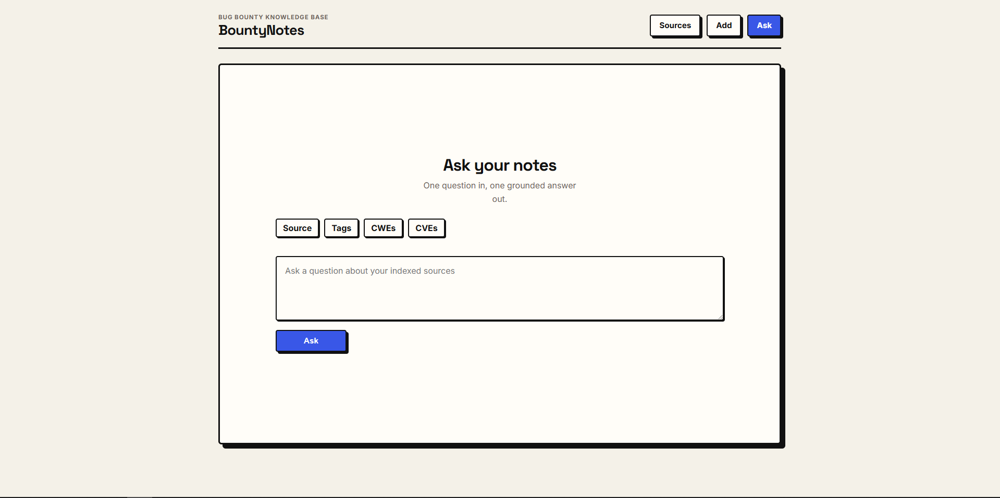

<div align="center">

# BountyNotes



*Store bug bounty write-ups, ask questions, get grounded answers with citations.*

[](https://angular.dev)
[](https://fastapi.tiangolo.com)
[](https://sqlite.org)
[](https://qdrant.tech)
[](https://docs.docker.com/compose/)


</div>

---

## Features

- [x] Add sources from raw text or URL
- [x] Background preprocessing (normalize, chunk, embed, index)
- [x] Metadata extraction (tags, CWE, CVE)
- [x] Ask questions with filters and grounded citations
- [ ] Source management (edit, delete)
- [ ] Chat history
- [ ] MCP server support
- [ ] Auto-filtering by AI agent

## What it does

You add sources (paste text or drop a URL), the backend processes them in the background (normalize, extract metadata, chunk, embed, index), and once they're ready you can ask natural-language questions and get answers backed by real citations from your sources.

## Stack

| Layer | Tech |
|---|---|
| Frontend | Angular 20 (standalone components) |
| API | FastAPI + SQLite |
| Vector search | Qdrant |
| LLM | DeepSeek (chat + metadata extraction) |
| Embeddings | OpenAI `text-embedding-3-small` |
| URL extraction | Exa |
| Dev infra | Docker Compose |

## Quick start

```bash
cp .env.example .env   # fill in your API keys
docker compose -f compose.yaml -f compose.dev.yaml up --build
```

Then open:
- **Frontend** → http://localhost:4200
- **API health** → http://localhost:8000/health
- **Qdrant dashboard** → http://localhost:6333/dashboard

Stop everything:

```bash
docker compose -f compose.yaml -f compose.dev.yaml down
```

## Environment variables

Copy `.env.example` to `.env`. The only things you must fill in are the three API keys:

| Variable | What it's for |
|---|---|
| `DEEPSEEK_API_KEY` | Chat + metadata extraction |
| `OPENAI_API_KEY` | Embeddings |
| `EXA_API_KEY` | URL content extraction |

The rest has sensible defaults. See `.env.example` for the full list.

## Repo layout

```
bountynotes/
├── backend/        # FastAPI, services, tests
├── frontend/       # Angular app
├── compose.yaml
├── compose.dev.yaml
└── README.md
```

Key entry points: `app.routes.ts`, `routers/sources.py`, `routers/ask.py`.

## How it works

```
Add source → persist → background job:
  normalize → extract metadata → chunk → embed → index in Qdrant → mark ready

Ask question → embed query → filtered Qdrant retrieval → discard stale hits → generate answer → return with citations
```

## API endpoints

| Method | Path | Purpose |
|---|---|---|
| `GET` | `/health` | Health check |
| `GET` | `/sources` | List all sources |
| `GET` | `/sources/{id}` | Source detail |
| `POST` | `/sources/manual` | Create source from text |
| `POST` | `/sources/url` | Create source from URL |
| `POST` | `/ask` | Ask a question |

## Dev commands

```bash
# Logs
docker compose -f compose.yaml -f compose.dev.yaml logs api
docker compose -f compose.yaml -f compose.dev.yaml logs web

# Frontend
cd frontend && npm test              # tests
cd frontend && npm run build         # build
cd frontend && npm run format:check  # prettier

# Backend
cd backend && pytest                          # tests
cd backend && python3 -m black --check app tests  # formatting
```